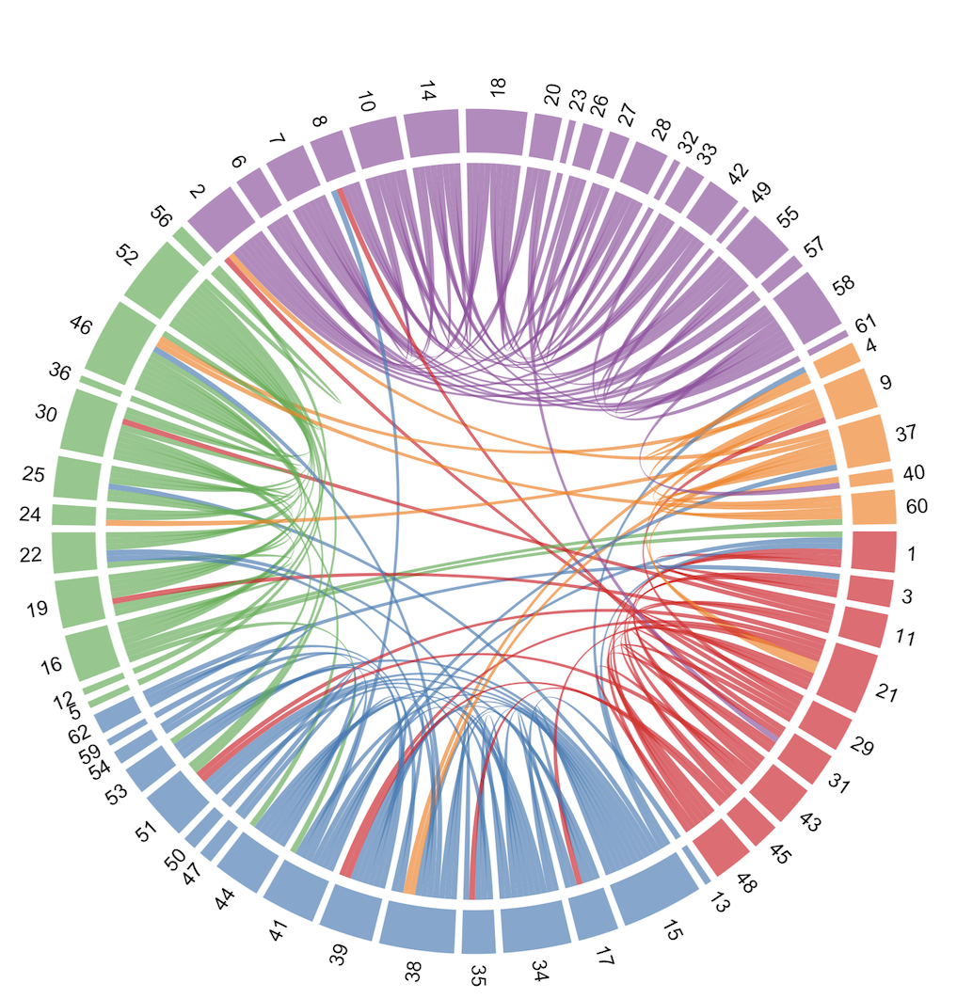

Homework 5: Network Visualization 
=================================

Kevin Cullen

Note: I did all work in R.

Data set
--------
I searched for a “medium” sized data set, using the ballpark figure Dr. Hayne gave in a lecture: 62 nodes with about 1000 edges. I tried a few data sets with 70-80 nodes and 2K-5K edges. These all rendered hairballs.

I wanted to avoid compromising the message in the data by haphazardly filtering or aggregating. I was more interested in using visualization to tell the data’s story. Then I stumbled on an edge list originally used for this article…

*The bottlenose dolphin community of Doubtful Sound features a large proportion of long-lasting associations.* Behav Ecol Sociobiol (2003) 54:396–405 DOI 10.1007/s00265-003-0651-y

<https://abdn.pure.elsevier.com/en/publications/the-bottlenose-dolphin-community-of-doubtful-sound-features-a-lar>

I originally found the data set at <http://networkrepository.com/soc-dolphins.php> , where it is described as "a list of all of links, where a link represents frequent associations between dolphins."

The article’s abstract says the following (which I didn’t read until halfway through the homework, after I became curious):

> We describe a small, closed population of bottlenose dolphins living at the southern extreme of the species’ range. Individuals live in large, mixed-sex groups in which no permanent emigration/immigration has been observed over the past 7 years...

> The community structure is temporally stable, compared to other bottlenose dolphin populations, and constant companionship seems to be prevalent in the temporal association pattern. Such high degrees of stability are unprecedented in studies of bottlenose dolphins and may be related to the ecological constraints of Doubtful Sound.

I was interested in the community detection feature after using the tutorial at <https://kateto.net/network-visualization>. The dolphin data set seemed ideal and it turned out to produce good results.

Community detection only required a couple of lines of code…

    clp <- cluster_optimal(igraph.net)
    class(clp)

Network Plot
------------
Community detection returns an object of class "communities" with its own built-in plotting function. However, I added the community information to the igraph object and used igraph’s plotting features to make something better.

I did further work in R to generate/assign colors (node and background) for each community in the network. I also tweaked the region/community markings.

I chose the `layout_with_fr` option and fiddled with the following settings to improve separation of the groups: `charge`, `max.sa.movement`, `spring.length`. I am not sure how much they helped, or whether any improvement was random chance.

I thought the visualization shown here did a good job of demonstrating the conclusions of the original article (which I only saw afterwards). “Fjords are low-productivity systems in which survival may easily require a greater level of co-operation, and hence group stability.” Unlike dolphins who live in the open ocean, these groups maintain long-term relationships with individuals in other nearby communities/pods because life is tough there.

### Network Plot - Dolphin Social Networks Colored by Community

Nodes = Dolphins. Communities detected with `cluster_optimal()`

Circle plots/chord diagrams
---------------------------
I thought my best results were with the chord diagrams I made, even though I spent much more time getting my data arranged correctly. (I had some bugs with sorting.) I thought the final results were visually stunning, easy to interpret and told the tale of the data well.

Not all was sunshine and roses with circlize. Legends were just too much hassle… lots of manual fiddling. Documentation could be better and while I modified tracks to get something like what I wanted, I wasn’t really sure how I got it to work.

I decided to add the ids as labels after seeing the network visualization in the original article. The authors used the dolphin names, which I thought would have been great around the wheel.

### Circle Plot - Dolphin Social Networks Colored by Community

Out-takes
---------
Just some fun stuff I did that wasn’t in the top 2…

Hive Plots
----------
“*By the way, there is no guarantee that any data set can be made into a hive plot, but there are certainly a number of data sets that will give a very useful hive plot after some thought*.”
- Bryan A. Hanson, *The HiveR Package* (July27,2017)
<https://cran.r-project.org/web/packages/HiveR/vignettes/HiveR.pdf>

My hive plots were terrible. I actually did these before the circle plots, but never achieved satisfactory results. When I put each of the five communities/pods on a separate axis, many edges/relationships did not appear on the plot. Perhaps because they would have crossed axes.

I don’t think there was a problem with my data, because my source-man-sink plot displayed the missing relationships. However, it looked like gibberish. I figured out how to arbitrarily assign communities/pods to axes, but almost gave up before managing to set the radius so that all members of each group appeared together. Edges missing from the 5-axis plot appeared in this version, as with the source-man-sink version.

### Hive Plot: source / man / sink (useless in this case)

### Hive Plot: communities assigned to/sorted on arbitrary axes

### Hive Plot: one community per axis (but relationships/edges were omitted)

Communities class built-in plot
-------------------------------
Straight out of the box, the community class’s built-in plotting funtion did an interesting job…

Because I couldn’t find documentation for modifying it, and because the igraph plotting worked so well (and had lots of documentation), I chose to hone that for my best effort.

### Network Plot - Dolphin Social Networks Colored by Community

Nodes = Dolphins. Communities detected with `cluster_optimal()`

Graphic from the original article
---------------------------------
I wonder what these folks used in 2003. I think my plots look better. I didn’t understand the caption at all.

*The bottlenose dolphin community of Doubtful Sound features a large proportion of long- lasting associations*. Behav Ecol Sociobiol (2003) 54:396–405 DOI 10.1007/s00265-003-0651-y